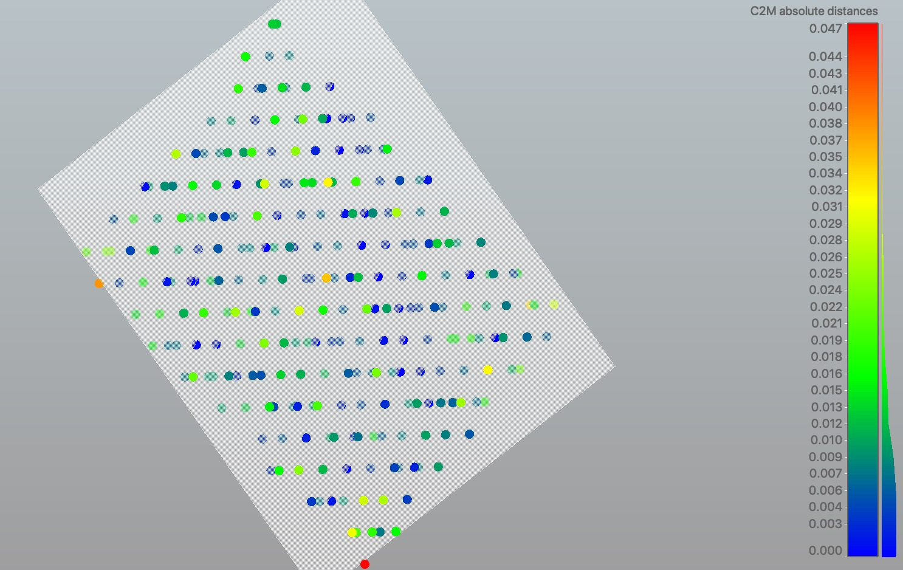
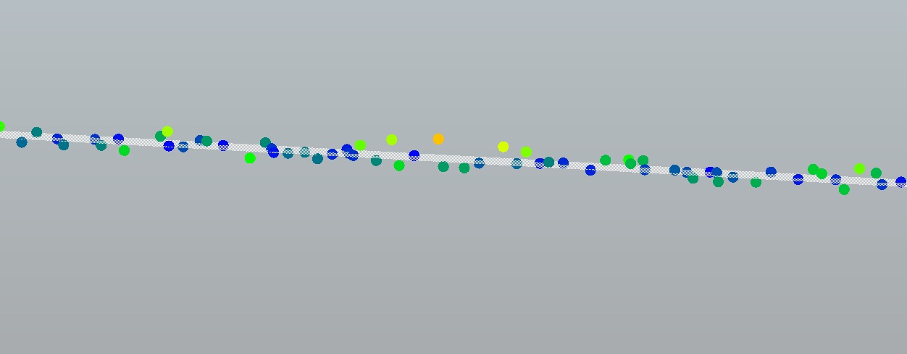

# Point clouds

Once upon a time this would have been a lidar workshop. Until mid-2006 when Structure from Motion photogrammetry became a thing and subsequently exploded. Now, it's about processing data from both lidar and photogrammetric sources.

## What do we mean by 'point cloud'?

A point cloud is generally a collection of vertices in 3D space, described by coordinates at each vertex, without a regular structure. An example is shown below - giving a sample of points from an airborne lidar dataset from a paved surface, shown around a least-squares fitted plane.

If we tilt the view, we see that point clouds are irregular in all three dimensions - and for photogrammetric clouds, even irregular in time, since each vertex represents an integration over time of a few images showing hopefully the same object!

Both lidar and photogrammetric point clouds are slightly inexact representations of the objects being measured - although the uncertainty of measurement is generally well understood.

## What's special about point clouds?

Current lidar sensors collect points at up to tens of thousands of points per cubic metre ( for example terrestrial laser scanners ), or tens of points per 2.5D metre over broad areas (airborne lidar). In either case, racking up datasets with many billions of points can be done pretty quickly.

Photogrammetric methods can generate point clouds at close to camera ground sampling distance - which may reach down to a centimetre or so. Again, creating very large, unstructured datasets.

In both cases, data don't exist on regular grids - and in both cases, there are three spatial dimensions encoded at each point; with generally a raft of other attributes (or dimensions)

## ASPRS LAS or something else?

The [LAS file format](https://www.asprs.org/divisions-committees/lidar-division/laser-las-file-format-exchange-activities) is a common data exchange standard maintained by the American Society for Photogrammetry and Remote Sensing. It's an open format, and you're welcome to join ASPRS and contribute \(see (https://www.asprs.org/divisions-committees/lidar-division/laser-las-file-format-exchange-activities) \)

It is heavily focussed on airborne lidar - and relatively inflexible \(compared to, say Stanford Ply which has a flexible data schema \). However - it's predictable to work with and forms the basis of many delivery standards (eg ICSM). Using the [LASzip](https://laszip.org) compressor, it's also relatively compact.

[next - why PDAL](0-why-pdal.md)
