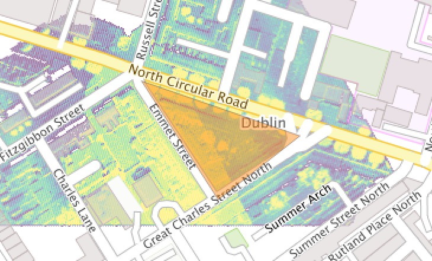
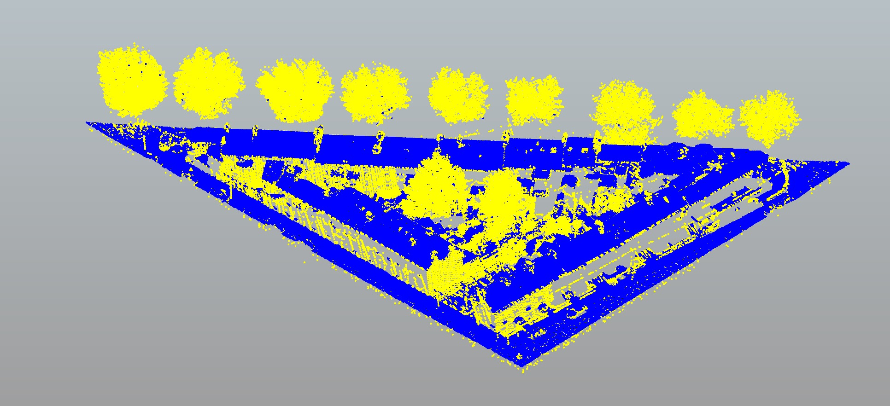

# Command line processing

## Querying data

One of the most fundamental tasks we can do is find out about our data - what's in it, where it is, and whether there are any problems with it.

We'll dive straight in and use PDAL to run a query on a .LAS file we've obtained. Here's a view of the data in CloudCompare:

[add image]

`pdal info T_316000_235500.laz`

...gives you a huge JSON spew of a bunch of file attributes, including summary statistics for each dimension in the file.

Let's look at some different metadata queries. What can you see from:

`pdal info T_316000_235500.laz --stats`  
`pdal info T_316000_235500.laz --metadata`  
`pdal info T_316000_235500.laz --summary`  
`pdal info T_316000_235500.laz --boundary`  

## Searching for points

We can look for information about points. Try:

`pdal info T_316000_235500.laz -p 0`

...it should tell you all about the first point (0-indexed) in the file.

More useful is finding points by geographic location. the `query` option to `info` can help:

`pdal info T_316000_235500.laz --query "316200, 235400, 21/3"`

...this will return the three nearest points to the coordinates provided (`/3`). You might use this if you want to find a set of points near ground control to assess accuracy.

`pdal info T_316000_235500.laz --query "316200, 235400, 21/8"`

...will return coordinates and dimension information for the 8 nearest points as a JSON dump.

**note:** PDAL doesn't check to see if your input point is sane - it returns a result regardless.

## Simple transformations

PDAL can do straightforward data translation as a one liner using the [translate](https://pdal.io/apps/translate.html) convenience application . We'll inspect some use cases here. The basic pattern

`pdal translate infile outfile --operation(s)`

To compress a file to LAZ format, try:

`pdal translate -i infile.las -o outfile.laz`

(or reverse to uncompress)

...which can be more fully expressed as:

`pdal translate -i infile.las -o outfile.laz --writers.las.compression=true`

Reprojecting data is also a useful tool. This moves data from [TM65 Irish grid](http://spatialreference.org/ref/epsg/tm65-irish-grid/) to [UTM zone 29](http://spatialreference.org/ref/epsg/wgs-84-utm-zone-29n/):

`pdal translate filters.reprojection -i T_316000_235500.laz -o outfile.laz --filters.reprojection.in_srs=EPSG:29902 --filters.reprojection.out_srs=EPSG:32629`

(why would we want to convert from a locally-optimised datum to a global system?)

## Filtering points

Points can be filtered many ways. We can restrict ranges point dimensions. If points carry labels (for example ASPRS classifications) we can use PDAL to exclude classes. We can also try to label 'noise' or points we don't think we need to pay attention to. Here, we'll limit elevations to 0-5m above the reference surface:

`pdal translate filters.range -i T_316000_235500.laz -o outfile.laz --filters.range.limits="Z[0:5]"`

[add image]

## Cropping points

We can also subset points by geometry using a WKT polygon, shown here:



Using the WKT polygon, try:

```
pdal translate filters.crop -i T_316000_235500.laz -o outfile.laz --filters.crop.polygon="POLYGON ((316261.303310555 235626.19273016,316328.453964166 235522.105517281,316399.983804495 235578.043293381,316261.303310555 235626.19273016))"
```

...to retrieve a subset of the points, shown here:




## Summary

PDAL can run as a command line application - using options to specify and modify stages and point views. This is really powerful, but can get unwieldy for long operations.


[next - pipelines](3-pipelines.md)
