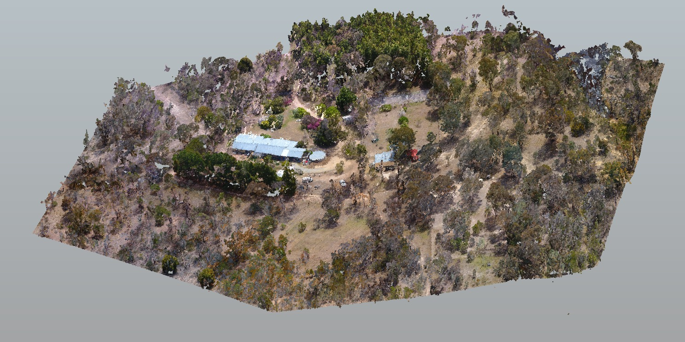
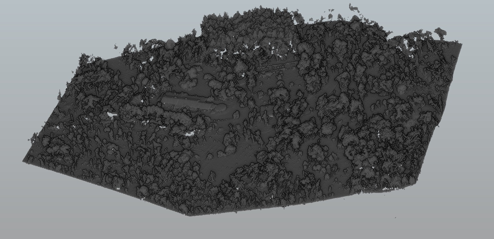
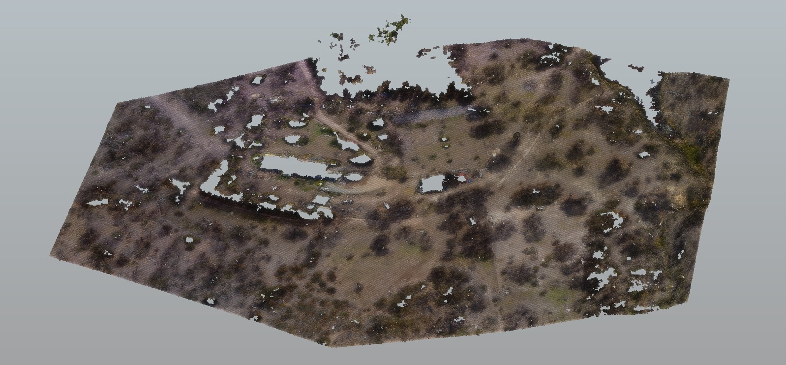
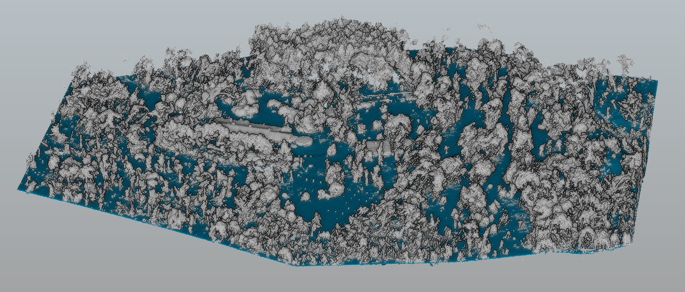
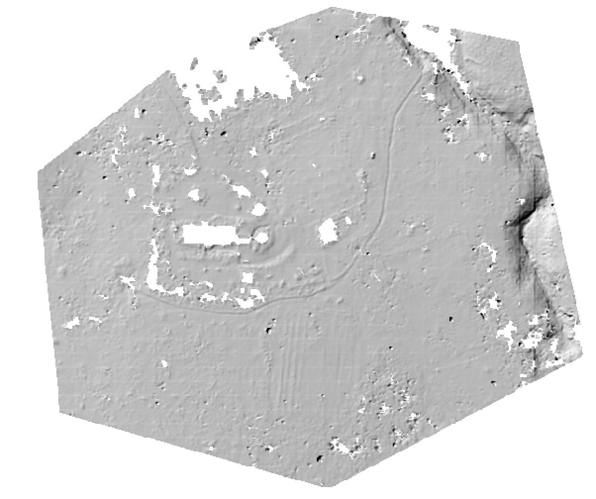

# The PDAL pipeline

PDAL's pipeline processing approach is a powerful tool for enabling complex, automated and repeatable workflows. We've already seen it in action exploring command line processing, and the concepts of readers, writers and filters.

What we've typed on the terminal is really invoking a PDAL pipeline in the background - which users a `reader` to ingest data to a `pointview` which can be operated on by `filters`, then writes out using a `writer`.

We can also cast these workflows into JSON configuration snippets, and run them using the `pipeline` application. Using reprojection as an example, we can create the JSON snippet `reprojection.json` as follows:

```
{
  "pipeline":[
    {
        "type":"readers.las",
        "filename":"APPF-farm-sample.laz"
    },
    {
        "type":"filters.reprojection",
        "in_srs":"EPSG:32756",
        "out_srs":"EPSG:28356"
    },
    {
        "type":"writers.las",
        "compression": "laszip",
        "filename":"APPF-farm-sample-reprojected.laz"
    }
  ]
}
```
...and run:

`pdal pipeline reprojection.json`

Just to remind ourselves, the command line equivalent is:

```
pdal translate inputfile.las outputfile.laz --filters.reprojection.in_srs="EPSG:32756" --filters.reprojection.out_srs="EPSG:28356"
```

However - instead of using increasingly long command line processes, the `pipeline` application allows creation of a library of standard processing tasks as easily-readable JSON files.

## Diving right in - labelling ground points

Classifying ground points is a fundamental task for point cloud processing. LiDAR data can often exploit 'last returns' for ground classification - and usually any LiDAR you come across in public repositories already has ground points labelled (it's often a requirement in acquisition contracts).

However, sometimes the classification is not amazing - it's hard, especially if the surveyed area contains a mixture of terrain types and objects. Further, many photogrammetric point clouds won't have ground labels attached to points.

We'll demonstrate ground labelling for RPAS data using the sample `APPF-farm-sample.laz`. Here's what the data look like:



...and coloured by classification:



It has no classification labels! Let's try to fix that. Create a file 'rpas-ground.json' and populate it with:
```
{
  "pipeline":[
    {
      "type":"readers.las",
      "filename":"APPF-farm-sample.laz"
    },
    {
      "type":"filters.assign",
      "assignment":"Classification[:]=0"
    },
    {
      "type":"filters.elm"
    },
    {
      "type":"filters.outlier"
    },
    {
      "type":"filters.smrf"
    },
    {
      "type":"filters.range",
      "limits":"Classification[2:2]"
    },
    {
      "type":"writers.las",
      "filename":"APPF-ground-default.laz"
    }
  ]
}
```

...save it, then run:

`pdal pipeline rpas-ground.json`

...but wait! there's a whole lot of new there. We've stacked a whole lot of filters together. Here we see the convenience of the pipeline approach. Starting from the top, we are:

- using `filters.assign` to label all points as unclassified
- applying `filters.elm` (extended local minimum) to label 'low points' as noise (ASPRS LAS class 7)
- then applying `filters.outlier`, using a statisical approach label remaining outlying points as noise (ASPRS LAS class 7)
- next, using `filters.smrf` (Simple Morphological Filter) to label points as 'ground', ignoring any points already labelled as 'noise'
- ...then finally, removing any points *not* labelled as ground from the output and writing them out to `APPF-ground-default.laz`

Once you've got an output file, if you have CloudCompare (or another LAS/LAZ viewer), open `APPF-ground-default.laz` and check the results:



You'll see here only points labelled as 'ground' are returned - we've dropped any noise and unclassified points using a range filter. It's also not the best segmentation of 'ground' points - a stand of trees has been mislabelled!

We've also leaped right into the deep end with a long chain of processing. The point here is showing how it's actually pretty easy - once you know what it is you need to do. We've used a `reader`, a bunch of `filters` chained together to operate on a `pointview`, and exported the result using a `writer`

Try pulling apart the pipeline and running parts of it, or removing some of the filters and see what happens by viewing results in CloudCompare. If you haven't already done so, that's the next step

## Overriding options, and making better ground

An easy assumption using pipelines is that everything is fixed to the parameters given in the JSON configuration. That's a little painful, especially if you have a thousand tiles to process!

We can fix that - using either command line overrides, or for clever folks, templating in JSON (we'll get to that shortly using Python).

Let's modify our pipeline a little to remove the final filter, and write out the entire dataset with noise and ground points labelled. We will then pass in some non-default `filters.smrf` options. Write the next JSON block out as `rpas-ground-allthepoints.json`

```
{
  "pipeline":[
    {
        "type":"readers.las",
        "filename":"APPF-farm-sample.laz"
    },
    {
        "type":"filters.assign",
        "assignment":"Classification[:]=0"
    },
    {
        "type":"filters.elm",
    },
    {
        "type":"filters.outlier"
    },
    {
        "type":"filters.smrf",
        "ignore":"Classification[7:7]"
    },
    {
        "type":"writers.las",
        "filename":"APPF-ground-smrf-allthepoints.laz"
    }
  ]
}
```

Now, invoke PDAL with some custom options to `filters.smrf`. The set used here were obtained by trial-and-error - experiment and see what changes you get:

```
pdal pipeline rpas-ground-allthepoints.json --filters.smrf.slope=0.1 --filters.smrf.window=30 --filters.smrf.threshold=0.4
```

Visualising the ground points from this process, we see that we've managed to remove the unwanted treetops:



In order to do this, we let `filters.smrf` know that our ground is flatter than the default option (`slope=0.1`), our non-ground items might be wider than the default expectation (`window=30`), and our noise level might be a little higher (`threshold=0.4`).

In short, any option from the stages used in the pipeline can be over-ridden by passing equivalent command line options. How might you write out a different filename, for example?

(hint - look at options for `writers.las`)

When designing pipelines, try to optimise them such that options which *need* to change often are as few as possible.

## I want to make a product from my data

Many end uses of point cloud data are not points at all - but rasters or other data products based on the points. We can string together more! In this example we'll create a DTM from the ground points we just created. Since we've experimentally determined good values for ground segmentation, we'll put those in the pipeline JSON:

```
{
  "pipeline":[
    {
        "type":"readers.las",
        "filename":"APPF-farm-sample.laz"
    },
    {
        "type":"filters.assign",
        "assignment":"Classification[:]=0"
    },
    {
        "type":"filters.elm"
    },
    {
        "type":"filters.outlier"
    },
    {
        "type":"filters.smrf",
        "ignore":"Classification[7:7]",
        "slope":0.1,
        "window":30,
        "threshold":0.4
    },
    {
        "type":"filters.range",
        "limits":"Classification[2:2]"
    },
    {
        "type":"writers.gdal",
        "filename":"APPF-dtm.tiff",
        "resolution":1,
        "output_type":"idw"
    }
  ]
}
```
...you can open the result in QGIS and take a look. Here's a preview:



Note that PDAL does not handle DTM filling - that's left to tools which do the job better (for example GDAL)

Meshes can be made the same way, try replacing the `writers.gdal` block with:
```
    {
        "type":"filters.poisson"
    },
    {
        "type":"writers.ply",
        "filename":"APPF-ground.ply"
    }
```

...to make a ground mesh - and then removing the range filter to create a surface mesh (this might take a while). Again, here's a sample, viewed in meshlab:


## Summary

Pipelines are the bread and butter of PDAL as a command line application. Re-usable code chunks which are easily readable, and reconfigurable on the fly.

[next - python and PDAL](4-python-and-pdal.md)
