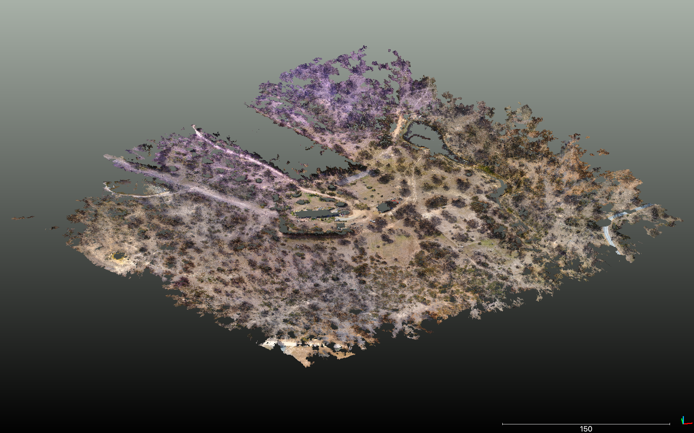

# The PDAL pipeline

PDAL's pipeline processing approach is a powerful tool for enabling complex, automated and repeatable workflows. We've already seen it in action exploring command line processing, and the concepts of readers, writers and filters.

What we've typed on the terminal is really invoking a PDAL pipeline in the background - which users a `reader` to ingest data to a `pointview` which can be operated on by `filters`, then writes out using a `writer`.

We can also cast these workflows into JSON configuration snippets, and run them using the `pipeline` application. Using reprojection as an example, we can create the JSON snippet `reprojection.json` as follows:

```
[
    {
        "type":"readers.las",
        "filename":"APPF-farm-sample.laz"
    },
    {
        "type":"filters.reprojection",
        "in_srs":"EPSG:32755",
        "out_srs":"EPSG:28355"
    },
    {
        "type":"writers.las",
        "compression": "laszip",
        "filename":"APPF-farm-sample-reprojected.laz"
    }
]
```
...and run:

`pdal pipeline reprojection.json`

    [using docker]
    docker run -it -v $(pwd):/opt/data/ pdal/pdal pipeline /opt/data/reprojection.json

Just to remind ourselves, the command line equivalent is:

```
pdal translate inputfile.las outputfile.laz --filters.reprojection.in_srs="EPSG:32756" --filters.reprojection.out_srs="EPSG:28356"
```

However - instead of using increasingly long command line processes, the `pipeline` application allows creation of a library of standard processing tasks as easily-readable JSON files.

Adding a verbosity flag to the command lets us gain some insight into how the process is going. I'd usually run pipelines like:

`pdal pipeline reprojection.json -v 8`

...where `-v 8` says 'set verbosity to the highest possible level - tell me lots about what is happening'.

## Diving right in - labelling ground points

Classifying ground points is a fundamental task for point cloud processing. lidar data can often exploit 'last returns' for ground classification - and usually any lidar you come across in public repositories already has ground points labelled (it's often a requirement in acquisition contracts).

However, sometimes the classification is not amazing - it's hard, especially if the surveyed area contains a mixture of terrain types and objects. Further, many photogrammetric point clouds won't have ground labels attached to points.

We'll demonstrate ground labelling for RPAS data using the sample `APPF-farm-sample.laz`. Here's what the data look like:


It has no classification labels - which we can test by running a metadata query:

```
pdal info APPF-farm-sample.laz --filters.stats.dimensions="Classification"  --filters.stats.count="Classification"
```

Let's try to fix that. Create a file 'rpas-ground.json' and populate it with:
```
[
    {
      "type": "readers.las",
      "filename": "APPF-farm-sample.laz"
    },
    {
      "type": "filters.assign",
      "assignment": "Classification[:]=0"
    },
    {
      "type": "filters.elm"
    },
    {
      "type": "filters.csf",
      "ignore:" "Classification[7:7]"
    },
    {
      "type": "filters.range",
      "limits": "Classification[2:2]"
    },
    {
      "type": "writers.las",
      "filename": "APPF-ground-default.laz"
    }
]
```

...save it, then run:

`pdal pipeline rpas-ground.json`

...but wait! there's a whole lot of new there. We've stacked a whole lot of filters together. Here we see the convenience of the pipeline approach. Starting from the top, we are:

- using `filters.assign` to label all points as unclassified ([documentation](https://pdal.io/stages/filters.assign.html))
- applying `filters.elm` (extended local minimum) to label 'low points' as noise (ASPRS LAS class 7) ([documentation](https://pdal.io/stages/filters.elm.html))
- next, using `filters.csf` (Cloth Simulation Filter) to label points as 'ground', ignoring any points already labelled as 'noise' ([documentation](https://pdal.io/stages/filters.csf.html))
- ...then finally, removing any points *not* labelled as ground from the output and writing them out to `APPF-ground-default.laz`

Once you've got an output file, if you have CloudCompare (or another LAS/LAZ viewer), open `APPF-ground-default.laz` and check the results:



You'll see here only points labelled as `ground` are returned - we've dropped any noise and unclassified points using a range filter. It's also not the best segmentation of `ground` points - a stand of trees has been mislabelled!

We've also leaped right into the deep end with a long chain of processing. The point here is showing how it's actually pretty easy - once you know what it is you need to do. We've used a `reader`, a bunch of `filters` chained together to operate on a `pointview`, and exported the result using a `writer`

Try pulling apart the pipeline and running parts of it, or removing some of the filters and see what happens by viewing results in CloudCompare.

## Overriding options, and making different ground

An easy assumption to make using pipelines is that everything is fixed to the parameters given in the JSON configuration.

We can fix that using either command line overrides in a shell. In Python, we can use variables - and make our pipelines quite dynamic.

Let's modify our pipeline a little to remove the final filter, and write out the entire dataset with noise and ground points labelled. We will then pass in some non-default `filters.csf` options. Write the next JSON block out as `rpas-ground-allthepoints.json`

```
[
    {
        "type": "readers.las",
        "filename": "APPF-farm-sample.laz"
    },
    {
        "type": "filters.assign",
        "assignment": "Classification[:]=0"
    },
    {
        "type": "filters.elm"
    },
    {
        "type": "filters.csf",
        "ignore": "Classification[7:7]"
    },
    {
        "type": "writers.las",
        "filename": "APPF-ground-csf-allthepoints.laz"
    }
]
```

Now, invoke PDAL with some custom options to `filters.csf`. The Cloth Simulation Filter defaults generally do a great job for this type of data, however - your particular dataset may need something special. Here's an example of over-riding filter defaults,and also how to write to a different file name:

```
pdal pipeline rpas-ground-allthepoints.json --filters.csf.rigidness=5 --filters.csf.resolution=5 --writers.las.filename=APPF-csf-modparams.laz
```

Visualising the ground points from this process, we see that


In short, any option from the stages used in the pipeline can be over-ridden by passing equivalent command line options.

When designing pipelines, try to optimise them such that options which *need* to change often are as few as possible.

## I want to make a product from my data

Many end uses of point cloud data are not points at all - but rasters or other data products based on the points. We can string together more! In this example we'll create a digital terrain model (DTM) from the ground points we just created:

```
[
    {
        "type":"readers.las",
        "filename":"APPF-farm-sample.laz"
    },
    {
        "type":"filters.assign",
        "assignment":"Classification[:]=0"
    },
    {
        "type":"filters.elm"
    },
    {
        "type":"filters.csf",
        "ignore":"Classification[7:7]",
    },
    {
        "type":"filters.range",
        "limits":"Classification[2:2]"
    },
    {
        "type":"writers.gdal",
        "filename":"rpas-dtm.tiff",
        "resolution": 0.2,
        "output_type":"idw"
    }
]
```
...you can open the result in QGIS and take a look. Here's a preview:


The `window_size` option in `writers.gdal` can be used to fill small holes - we haven't applied it here, but you could add this to your pipeline to remove small data gaps.

Also note that we didn't quite remove all the tree points. Working from a ground-first approach may not be the best strategy here. Perhaps with RPAS data, we should identify all the other things (buildings, trees...) and call the leftover points either ground or noise (see, for example: https://smathermather.com/2018/12/07/classifying-point-clouds-with-cgal/)

## Other ways of labelling 'ground'

This exercise originally used the [Simple Morphological Filter](https://pdal.io/stages/filters.smrf.html) to label ground points, and found that for `filters.smrf` our ground is flatter than the default option (`slope=0.1`), our non-ground items might be wider than the default expectation (`window=30`), and our noise level might be a little higher (`threshold=0.4`). Try building a pipeline which will run with these options:

```
pdal pipeline rpas-ground-smrf.json --filters.smrf.slope=0.1 --filters.smrf.window=30 --filters.smrf.threshold=0.4
```

...and compare results to the Cloth Simulation Filter. For my own work, I use the Cloth Simulation Filter every time I need to find ground in photogrammetric point clouds.


## Summary

Pipelines are the bread and butter of PDAL as a command line application. Re-usable code chunks which are easily readable, and reconfigurable on the fly.

[next - python and PDAL](4-python-and-pdal.md)
